<div align="center">

# Vela

**A multi-tenant patient intake, consultation access, and retention orchestration system for virtual care.**

One workspace. One tenant context. One clear next action.


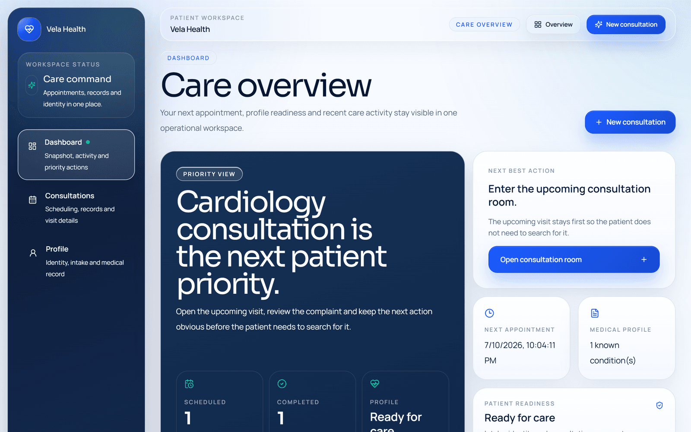

</div>

---

## Table of Contents

- [What Is Vela](#what-is-vela)
- [Product Tour](#product-tour)
- [System Architecture](#system-architecture)
- [Request Lifecycle](#request-lifecycle)
- [Multi-Tenant Strategy](#multi-tenant-strategy)
- [Data Model](#data-model)
- [Authentication & Session Routing](#authentication--session-routing)
- [Security Controls](#security-controls)
- [Rate Limiting](#rate-limiting)
- [Testing](#testing)
- [Project Structure](#project-structure)
- [Getting Started](#getting-started)
- [Production Posture](#production-posture)
- [Roadmap](#roadmap)

---

## What Is Vela

Vela is a product system for digital care operations, not a collection of disconnected healthcare screens.

Most telehealth products are functionally adequate but operationally noisy: patient state is fragmented across flows, the next action is unclear, tenant context is bolted on late, and reliability concerns are deferred until scale forces them into scope. Vela explores the opposite approach — a care workspace that treats **operational clarity, tenant isolation, and controlled product scope as first-class engineering constraints**.

The current repository is the patient-facing application layer:

| System                                 | What it does                                                                        |
| -------------------------------------- | ----------------------------------------------------------------------------------- |
| **Multi-tenant patient access**        | Host-resolved tenant context, tenant-scoped sessions and credentials                |
| **Guided intake & onboarding**         | Identity, symptom context, and medical history captured in a controlled progression |
| **Consultation scheduling & re-entry** | Booking, reopening, and preserving the patient's place in the care journey          |
| **Consultation workspace**             | Notes, prescription capture, and status transitions                                 |
| **Patient record access**              | Consolidated personal, intake, and clinical summary data                            |
| **Hardened mutation paths**            | Distributed rate limiting, audit events, validated payloads, response hardening     |

## Product Tour

| Landing                                       | Sign in                                 |
| --------------------------------------------- | --------------------------------------- |
| 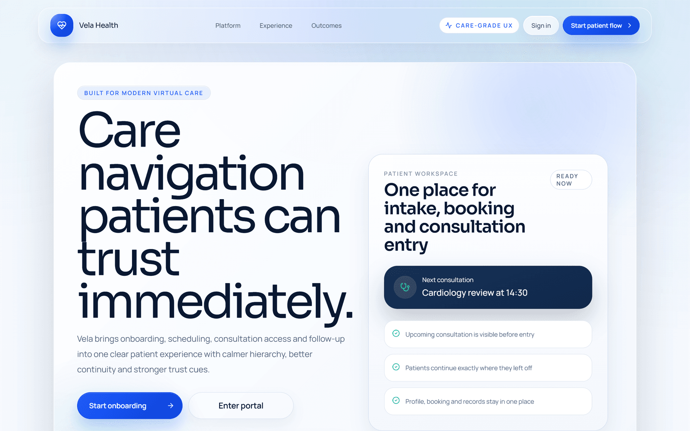 | 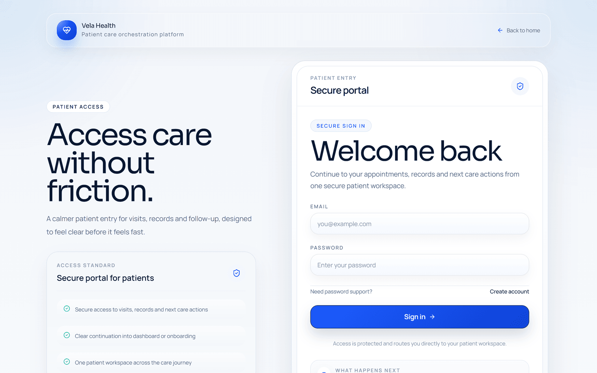 |

| Consultations                                            | Scheduler                                                              |
| -------------------------------------------------------- | ---------------------------------------------------------------------- |
| 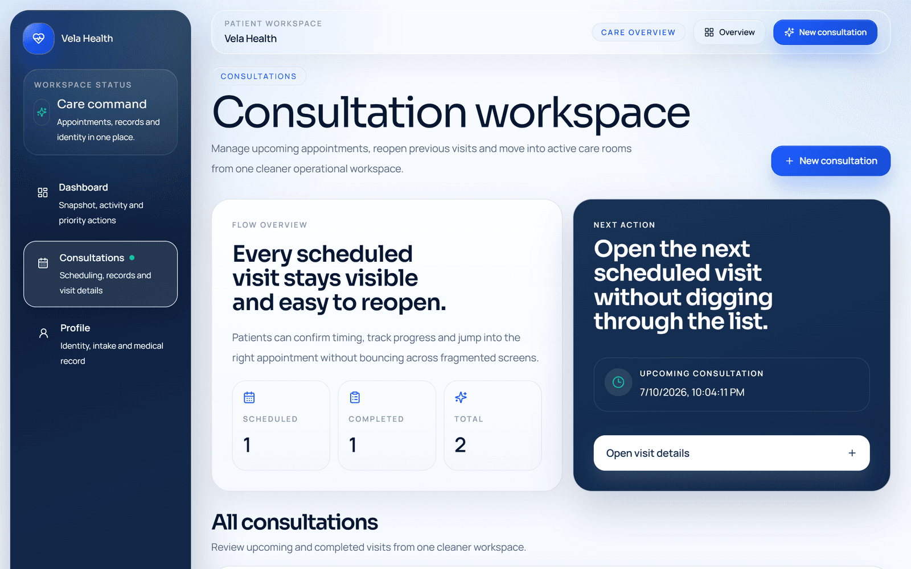 | 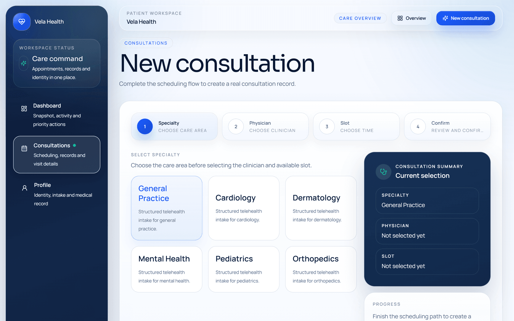 |

| Consultation workspace                                                 | Patient profile                                  |
| ---------------------------------------------------------------------- | ------------------------------------------------ |
| 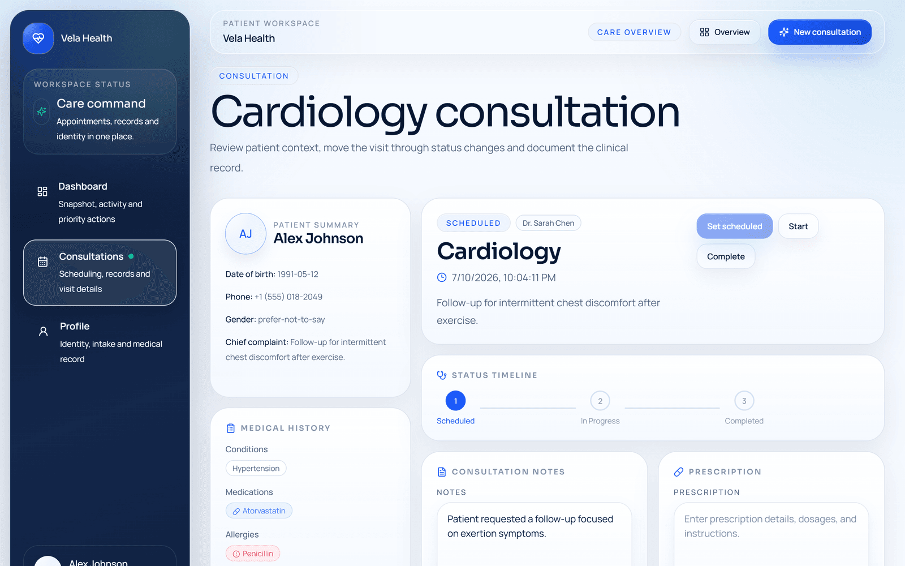 | 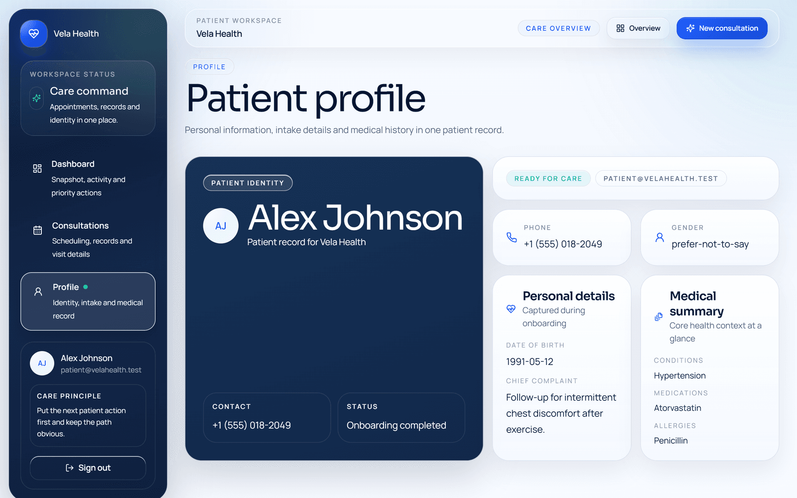 |

## System Architecture

Vela is a deliberately narrow v1: a single Next.js App Router application in front of PostgreSQL, with security controls embedded in the application layer rather than deferred to a future platform rewrite.

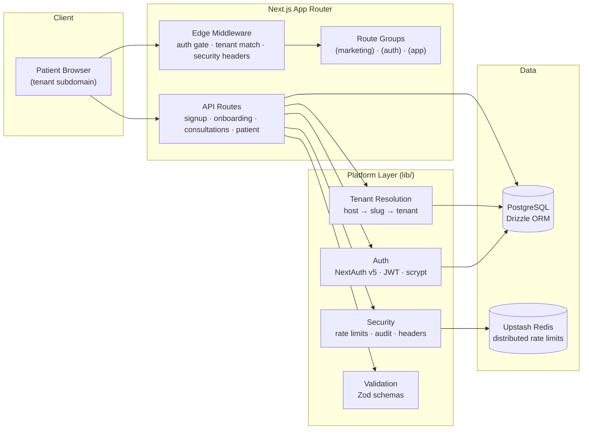

### Design Principles

- **Tenant context is resolved early** — from the request host, before any data access — and propagated through session state.
- **Sensitive writes stay behind validated API routes.** Every mutation is authenticated, rate-limited, Zod-validated, tenant-scoped, and audited.
- **Ownership is enforced in the query, not in the view.** Patient and consultation reads always combine tenant _and_ ownership predicates at the SQL level.
- **Synchronous request-response over distributed choreography.** v1 favors correctness and a small trust boundary over premature event-driven complexity.

## Request Lifecycle

Every sensitive mutation follows the same hardened pipeline. Creating a consultation, end to end:

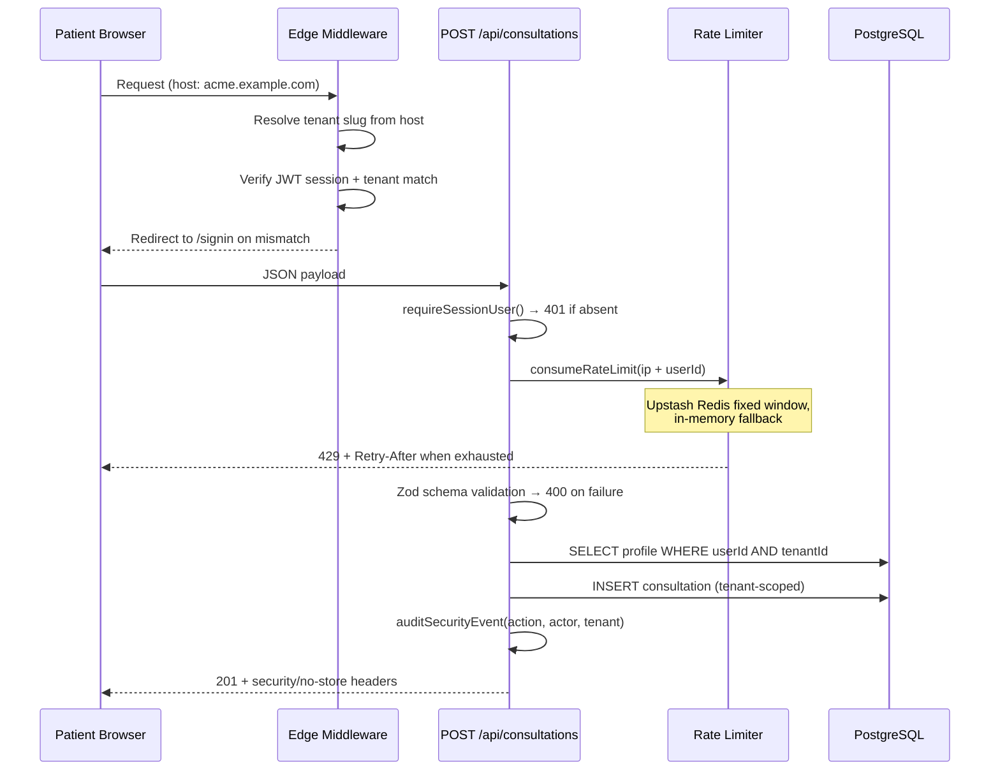

The same shape applies to sign-in, sign-up, onboarding, and consultation updates — only the schema, the rate-limit budget, and the audit action change.

## Multi-Tenant Strategy

Vela is tenant-aware **by default**, not by convention. Tenancy is enforced at four independent layers, so a failure in any one layer does not expose cross-tenant data.

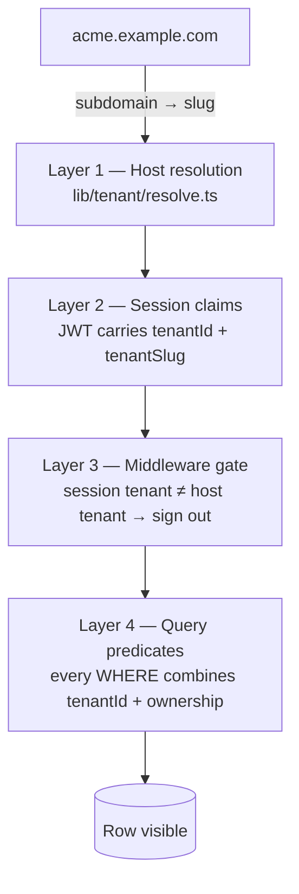

- **Host resolution** — the first subdomain segment maps to the tenant slug (`acme.example.com` → `acme`); apex domains, `www`, and local hosts fall back to the default tenant. ([lib/tenant/resolve.ts](lib/tenant/resolve.ts))
- **Tenant-scoped credentials** — email uniqueness is `(tenant_id, email)`, so the same patient email can exist independently per tenant, and sign-in only searches the resolved tenant. ([auth.ts](auth.ts))
- **Middleware enforcement** — an authenticated session visiting another tenant's host is redirected to sign-in rather than silently served. ([middleware.ts](middleware.ts))
- **Data-layer predicates** — reads and writes always filter by `tenant_id` _and_ the owning user; a forged session mixing user A with tenant B resolves zero rows. This invariant is covered by integration tests against a real PostgreSQL ([tests/integration/tenant-isolation.test.ts](tests/integration/tenant-isolation.test.ts)).

## Data Model

Four tables, every product row carrying `tenant_id`:

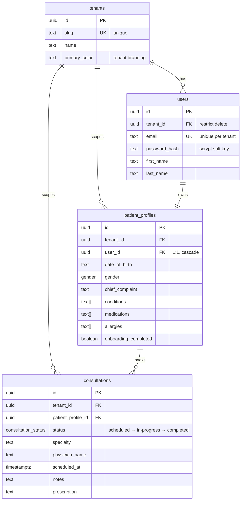

Schema definition and migrations live in [lib/db/schema.ts](lib/db/schema.ts) and `lib/db/migrations/`, managed by Drizzle Kit.

## Authentication & Session Routing

Sessions are stateless JWTs (NextAuth v5, 8-hour max age, 15-minute rotation) carrying `tenantId`, `tenantSlug`, and `onboardingCompleted` as claims. Passwords are hashed with **scrypt** and verified with a timing-safe comparison — no third-party identity dependency in v1.

The edge middleware acts as a small state machine over those claims:

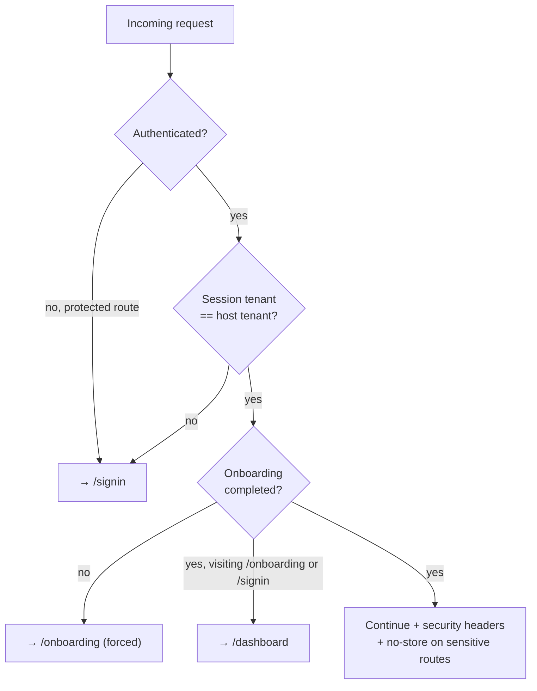

A patient can never land in an ambiguous state: unauthenticated users are pushed to sign-in, incomplete intakes are pushed back into onboarding, and completed patients cannot re-enter auth or onboarding surfaces.

## Security Controls

Security is embedded in the application layer and documented in [SECURITY.md](SECURITY.md).

| Control                   | Implementation                                                                                        | Location                                                 |
| ------------------------- | ----------------------------------------------------------------------------------------------------- | -------------------------------------------------------- |
| Distributed rate limiting | Upstash Redis fixed window, per-instance in-memory fallback                                           | [lib/security/rate-limit.ts](lib/security/rate-limit.ts) |
| Payload validation        | Zod schemas on every API mutation                                                                     | [lib/validations/](lib/validations)                      |
| Security audit trail      | Structured events with PII masking (emails) and clinical redaction (notes, prescriptions, complaints) | [lib/security/audit.ts](lib/security/audit.ts)           |
| Response hardening        | CSP (production), HSTS, X-Frame-Options, nosniff, COOP/CORP, Permissions-Policy                       | [lib/security/headers.ts](lib/security/headers.ts)       |
| Cache hygiene             | `no-store` on all authenticated and clinical responses                                                | [lib/security/headers.ts](lib/security/headers.ts)       |
| Credential storage        | scrypt (64-byte key, per-user salt), timing-safe verify                                               | [lib/auth/password.ts](lib/auth/password.ts)             |
| Tenant isolation          | Four-layer enforcement (host → session → middleware → query)                                          | see [Multi-Tenant Strategy](#multi-tenant-strategy)      |

## Rate Limiting

Sensitive flows are budgeted independently, keyed by client IP **and** identity so a single actor cannot exhaust a shared bucket:

| Flow                | Budget | Window | Key                            |
| ------------------- | ------ | ------ | ------------------------------ |
| Sign in             | 10     | 10 min | `ip + tenant + email`          |
| Sign up             | 5      | 15 min | `ip + email`                   |
| Onboarding updates  | 30     | 10 min | `ip + userId`                  |
| Consultation create | 15     | 10 min | `ip + userId`                  |
| Consultation update | 30     | 10 min | `ip + userId + consultationId` |

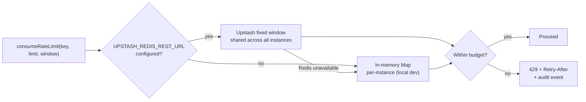

The distributed limiter matters on serverless: each Vercel invocation may run on a fresh instance, so an in-memory-only limiter silently degrades to no limiter at all. Redis outages **fail open to the in-memory floor** rather than taking clinical flows down — a deliberate availability-over-strictness call for this tier of control.

## Testing

The test suite targets the highest-risk surfaces first: tenant isolation, rate limiting, and input validation.

```
Test Files  6 passed (6)
     Tests  51 passed (51)
```

| Suite                                | Coverage                                                                                                                                            |
| ------------------------------------ | --------------------------------------------------------------------------------------------------------------------------------------------------- |
| `tests/unit/tenant-resolve`          | Host → tenant slug resolution: ports, `www`, apex domains, local hosts, casing                                                                      |
| `tests/unit/rate-limit`              | Window accounting, key independence, expiry reset, `Retry-After` decay (fake timers)                                                                |
| `tests/unit/validations/*`           | Auth, consultation, and onboarding Zod schemas — password policy, enum boundaries, date-of-birth range, payload limits                              |
| `tests/integration/tenant-isolation` | Real PostgreSQL: cross-tenant list/read/write denial, forged-session (user A + tenant B) denial, same-tenant ownership denial, owner update success |

```bash
pnpm test          # full suite (integration skips gracefully if Postgres is unreachable)
pnpm test:watch    # watch mode
```

Integration tests seed two isolated tenants, exercise the real API route handlers against PostgreSQL, and clean up after themselves. When `DATABASE_URL` is unreachable the suite skips with a warning instead of failing — CI without a database stays green on unit coverage.

## Project Structure

```
vela/
├── app/
│   ├── (marketing)/          # public product presentation
│   ├── (auth)/               # sign in · sign up
│   ├── (app)/                # authenticated patient workspace
│   │   ├── dashboard/
│   │   ├── onboarding/
│   │   ├── consultations/    # list · [id] workspace · new scheduler
│   │   └── profile/
│   └── api/                  # signup · onboarding · patient · consultations
├── components/
│   ├── pages/                # one composition per product surface
│   ├── consultations/ dashboard/ profile/ forms/
│   ├── layout/               # AppShell · Sidebar · headers · nav
│   └── ui/                   # primitives (Button, Card, Stepper, TagInput…)
├── lib/
│   ├── auth/                 # NextAuth config · session helpers · scrypt
│   ├── tenant/               # host resolution · tenant lookup
│   ├── security/             # rate limits · audit · headers · request utils
│   ├── validations/          # Zod schemas
│   └── db/                   # Drizzle schema · migrations · client
├── tests/
│   ├── unit/                 # pure logic: tenant, rate limit, validation
│   └── integration/          # tenant isolation against real PostgreSQL
├── middleware.ts             # auth gate · tenant match · security headers
└── auth.ts                   # NextAuth entrypoint (credentials provider)
```

## Getting Started

### Prerequisites

- Node.js 20+
- pnpm 10 (pinned via `packageManager`)
- Docker (local PostgreSQL)

### Setup

```bash
pnpm install
cp .env.example .env.local        # then set NEXTAUTH_SECRET
docker compose up -d              # PostgreSQL 16
pnpm db:migrate
pnpm db:seed                      # demo tenant + patient
pnpm dev
```

Seeded demo credentials: `patient@velahealth.test` / `VelaHealth123`.

### Environment

| Variable                   | Required   | Purpose                                        |
| -------------------------- | ---------- | ---------------------------------------------- |
| `DATABASE_URL`             | yes        | PostgreSQL connection string                   |
| `NEXTAUTH_URL`             | yes        | Canonical app URL                              |
| `NEXTAUTH_SECRET`          | yes        | JWT signing secret (`openssl rand -base64 32`) |
| `NEXT_PUBLIC_APP_URL`      | yes        | Public app URL                                 |
| `UPSTASH_REDIS_REST_URL`   | production | Distributed rate limiting                      |
| `UPSTASH_REDIS_REST_TOKEN` | production | Distributed rate limiting                      |

Without the Upstash variables, rate limiting falls back to a per-instance in-memory store — acceptable locally, insufficient on serverless.

### Scripts

| Command                                                     | Action                                                            |
| ----------------------------------------------------------- | ----------------------------------------------------------------- |
| `pnpm dev`                                                  | Dev server with `.env.local` loading                              |
| `pnpm test` / `pnpm test:watch`                             | Vitest suite                                                      |
| `pnpm typecheck` / `pnpm lint`                              | TypeScript · ESLint (enforced pre-commit via husky + lint-staged) |
| `pnpm db:generate` / `db:migrate` / `db:studio` / `db:seed` | Drizzle Kit workflow                                              |

## Production Posture

Vela is deployed on Vercel, optimized for **correctness over distributed complexity**:

- writes are synchronous; mutation paths are narrow
- failure handling stays close to the request boundary
- rate limiting is distributed (Upstash) and fails open to a per-instance floor
- database initialization is deferred to first use so builds succeed without runtime secrets

### Intentionally Deferred

v1 acknowledges but does not yet introduce: queue-based background work, webhook delivery guarantees, eventual-consistency patterns, cron reconciliation, SIEM-backed audit ingestion, and a HIPAA-grade compliance program. The direction is not "ignore operations" — it is **sequence them in the right order**.

Equally deliberate product exclusions: provider-facing multi-role operations, autonomous AI decision-making in live care paths, EHR integrations, billing/claims, and real-time video infrastructure. These keep the trust boundary small while the core patient workflow is hardened.

### AI-Adjacent by Design

Vela is positioned as infrastructure for future AI-assisted care workflows — structured intake, validated clinical context, constrained scheduling, tenant-aware state, and auditable mutation paths are exactly the surfaces AI triage needs. The live implementation remains deterministic and human-bounded: no autonomous diagnosis, no model-driven prescriptions, no background agent loops.

## Roadmap

- Provider-side operational workspace (physicians as first-class records, not text fields)
- Durable queue and job orchestration layer
- Webhook ingestion with retry semantics for external systems
- Richer consultation lifecycle states
- Production-grade observability and audit export pipeline
- AI-assisted triage on top of structured patient intake
- Tenant configuration and branding control plane
- Architecture Decision Records (`docs/adr/`) for tenancy, session model, and workflow execution boundaries

---

<div align="center">

**Vela** — the strongest signal is not that it does many things.
It is that it shows operational judgment: explicit scope, tenant isolation, auditability, and hardened mutation paths.

</div>
