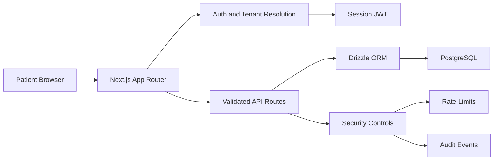

# Vela

Vela is a multi-tenant patient intake, consultation access, and retention orchestration system for virtual care.

It is designed to make the patient-facing care journey feel operationally trustworthy: one workspace, one tenant context, one clear next action.

## What Is Vela

Vela is a product system for digital care operations, not a collection of disconnected healthcare screens.

The current repository contains the patient-facing application layer for:

- tenant-aware authentication
- guided onboarding and intake capture
- consultation scheduling and reopening
- consultation room operations
- patient profile and medical context access
- audit-aware and rate-limited clinical record handling

In practical terms, Vela is the interface layer that sits between a patient, a tenant-specific care experience, and the operational workflows required to move that patient through intake, scheduling, and follow-up without fragmentation.

## Why It Exists

Most telehealth products are functionally adequate but operationally noisy. They can book visits, render forms, and save notes, but they often fail at the system level:

- patient state is fragmented across flows
- the next action is unclear
- tenant context is bolted on late
- product surfaces look disconnected from clinical operations
- reliability concerns are deferred until scale forces them into scope

Vela exists to explore the opposite approach: a care workspace that treats operational clarity, tenant isolation, and controlled product scope as first-class engineering constraints.

## Core Features

Vela is framed as systems, not isolated features.

- Multi-tenant patient access system with host-resolved tenant context and scoped session state
- Guided intake and onboarding system that captures identity, symptom context, and medical history in a controlled progression
- Consultation scheduling and re-entry system that preserves the patient’s place in the care journey
- Consultation workspace system for notes, prescription capture, and status transitions
- Patient record access system that consolidates personal, intake, and clinical summary data
- Response hardening, audit logging, and rate-limited mutation system for sensitive flows

## Architecture

The repository is organized around product surfaces and platform utilities rather than a generic component dump.

- `app/`
  App Router entrypoints, route groups, and API routes
- `components/`
  product surfaces, interaction primitives, and layout shells
- `lib/`
  auth, tenant resolution, data access, validation, security utilities, and shared logic
- `hooks/`
  query and view-model helpers
- `types/`
  shared TypeScript contracts
- `scripts/`
  local development helpers and seed routines

### Route Groups

- `app/(marketing)`
  public product presentation
- `app/(auth)`
  sign in and account creation
- `app/(app)`
  authenticated patient workspace

## Stack

- `Next.js 14`
- `React 18`
- `TypeScript`
- `Tailwind CSS`
- `Framer Motion`
- `NextAuth v5`
- `Drizzle ORM`
- `PostgreSQL`
- `TanStack Query`
- `React Hook Form`
- `Zod`
- `Zustand`

## System Design

Vela follows a deliberately narrow v1 design.



### Design Principles

- Tenant context is resolved early and propagated through session state.
- Sensitive writes stay behind validated API routes.
- Patient and consultation records are always filtered by tenant and ownership boundaries.
- The current product favors synchronous request-response flows over distributed event choreography.
- Security controls are embedded in the application layer, not deferred to a future platform rewrite.

### Intentional Constraints

Senior product systems do not try to do everything in v1.

Vela intentionally excludes:

- provider-facing multi-role operations
- webhook-driven workflow engines
- background queue orchestration for clinical actions
- autonomous AI decision-making in live care paths
- EHR integrations
- billing and claims flows
- real-time video infrastructure

These omissions are deliberate. They preserve reliability, keep the trust boundary smaller, and reduce operational complexity while the core patient workflow is still being hardened.

## Multi-Tenant Strategy

Vela is tenant-aware by default rather than tenant-aware by convention.

- tenant resolution is derived from the request host
- session payloads carry `tenantId` and `tenantSlug`
- database reads and writes are scoped by tenant
- unique constraints are tenant-scoped where appropriate
- patient and consultation access checks combine tenant and ownership constraints

This allows the application to support isolated branded workspaces without treating tenant separation as a UI-only concern.

Relevant areas:

- [`auth.ts`](./auth.ts)
- [`middleware.ts`](./middleware.ts)
- [`lib/tenant/resolve.ts`](./lib/tenant/resolve.ts)
- [`lib/tenant/server.ts`](./lib/tenant/server.ts)
- [`lib/db/schema.ts`](./lib/db/schema.ts)

## AI Orchestration

Vela should be read as AI-adjacent infrastructure, not as an LLM demo.

The current repository is preparing the right operational surfaces for future AI-assisted care workflows:

- structured intake capture
- validated clinical context
- constrained scheduling flow
- tenant-aware patient state
- auditable mutation paths

That matters because usable AI in healthcare products is rarely a single chat box. It is a system problem: inputs, scopes, retries, auditability, fallback behavior, and tenant boundaries.

### Current Position

Vela v1 intentionally does **not** ship:

- autonomous diagnosis
- model-driven prescription generation
- background agent loops
- queue-based AI workers
- webhook-triggered orchestration chains

The repository is therefore positioned for future AI-assisted triage and scheduling, but the live implementation remains deterministic and human-bounded.

## Local Development

### Prerequisites

- `Node.js`
- `pnpm`
- `Docker`
- local PostgreSQL via Docker Compose

### Setup

```bash
pnpm install
cp .env.example .env.local
docker compose up -d
pnpm db:migrate
pnpm db:seed
pnpm dev
```

Windows `cmd` equivalent:

```bat
copy .env.example .env.local
```

### Environment Variables

The project expects at least:

- `DATABASE_URL`
- `NEXTAUTH_URL`
- `NEXTAUTH_SECRET`
- `NEXT_PUBLIC_APP_URL`

## Production Considerations

This repository already includes part of the production posture, and explicitly defers the rest.

### Implemented Today

- tenant isolation in auth and data queries
- rate limiting on sign in, sign up, onboarding, and consultation mutations
- response hardening headers
- no-store cache behavior for sensitive routes
- audit events for auth attempts and clinical record access
- password hashing and timing-safe verification
- validated API payloads via `Zod`

See [`SECURITY.md`](./SECURITY.md) for the current control set.

### Operational Posture

Vela is currently optimized for correctness over distributed complexity.

- writes are synchronous
- mutation paths are narrow
- fallback behavior is explicit and human-readable
- failure handling stays close to the request boundary

### Intentionally Deferred

To keep v1 reliable, the following are acknowledged but not yet introduced:

- Redis-backed distributed rate limiting
- queue strategy for background work
- webhook delivery and retry guarantees
- eventual consistency patterns between internal domains
- async job recovery flows
- cron-based reconciliation jobs
- SIEM-backed centralized audit ingestion
- HIPAA-grade operational compliance program

The direction is not “ignore operations.” The direction is “sequence them in the right order.”

## Roadmap

Near-term evolution for Vela is systems-oriented:

- provider-side operational workspace
- durable queue and job orchestration layer
- webhook ingestion and retry model for external systems
- EHR and scheduling provider integration boundary
- richer consultation lifecycle states
- production-grade observability and audit export pipeline
- AI-assisted triage support on top of structured patient intake
- tenant configuration and branding control plane

## ADRs

The repository does not yet contain formal Architecture Decision Records.

That is a gap worth closing next. The first ADRs should likely cover:

- tenant resolution strategy
- auth/session model
- database tenancy model
- synchronous versus queued workflow execution
- AI scope boundaries for patient-facing flows

Recommended future location:

- `docs/adr/0001-tenant-resolution.md`
- `docs/adr/0002-auth-session-model.md`
- `docs/adr/0003-workflow-execution-boundaries.md`

## Screenshots

The README is ready for product screenshots once they are committed to the repository.

Suggested captures:

- landing and patient access surface
- patient dashboard workspace
- consultation scheduling flow
- consultation workspace detail
- patient profile record view

Suggested path:

- `docs/screenshots/landing.png`
- `docs/screenshots/dashboard.png`
- `docs/screenshots/consultation-scheduler.png`
- `docs/screenshots/consultation-workspace.png`
- `docs/screenshots/profile.png`

## Demo Deployment

Vela is deployed on Vercel.

Add the canonical production alias here once the final domain is assigned:

- `https://your-production-domain.vercel.app`

Recommended practice:

- keep `main` as the production branch
- use preview deployments for branch validation
- pin all production environment variables inside Vercel rather than relying on local-only configuration

## Repository Notes

This project should read as a product system under active hardening, not as a maximalist feature demo.

The strongest signal in Vela is not “it does many things.”

The strongest signal is that it is beginning to show operational judgment:

- explicit scope boundaries
- tenant-aware isolation
- auditability
- request-path hardening
- validated mutations
- deliberate exclusion of distributed complexity until it is justified
